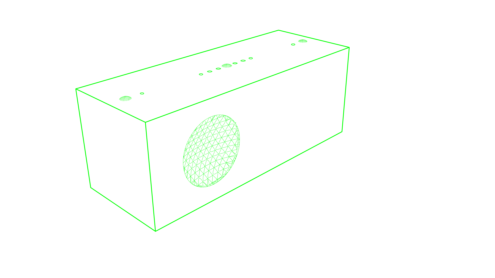

Smart Speaker from Scratch
==========================

The project is about to make an affordable, open source smart speaker. It should be able to run Amazon Alexa, Google Assistant, MyCroft, Home Assistant, Mopidy and etc.

See the detail at [hardware/prototype-1](/hardware/prototype-1)

### To Do
- Hardware
  - [x] [prototype #1 - Rasbperry Pi + ReSpeaker 4 Mic Linear Array + 45mm Speaker](/hardware/prototype_1)
  - [ ] prototype #2 (on-going)
  - [ ] ...

- Software
  - [ ] AEC (Acoustic Echo Cancellation), See [ec](https://github.com/voice-engine/ec)
  - [ ] ...

- Design
  - [x] prototype #1 - paper case
  - [ ] prototype #2 - wood case, made with [Boxes](https://github.com/florianfesti/boxes)
  - [ ] ...

- Document
  - [x] [Record & Play Audio on Linux](https://github.com/voice-engine/make-a-smart-speaker/issues/5)
  - [ ] Steps to make prototype #1
  - [ ] Introduce how AEC works
  - [ ] ...

### Why

[中文](https://zhuanlan.zhihu.com/p/58690069)

Why should we make an open source smart speaker when there are so many smart speakers on the market? Because these smart speakers are designed from vendors' perspective, not from users' perspective. These smart speakers have two issues:

1. privacy - these speakers are always-listening black boxes which scare lots of people
2. functionality - these speakers can be more powerful, but are limited by the vendors

One best way to eliminate privacy concerns is open source.

Most of smart speakers have very powerful ARM processors. Some even run Android OS just like an Android phone.  The smart speakers only is limited to run only one app, but they have the ability to run thousands of applications.

I want an open source smart speaker which can run Amazon Alexa and Google Assistant at the same time, and also is able to run Home Assistant, Mopidy, Snapcast, Nextcloud and etc.
Maybe you want one too. You can this project on Github or [hackaday.io](https://hackaday.io/project/164221-smart-speaker-from-scratch)

